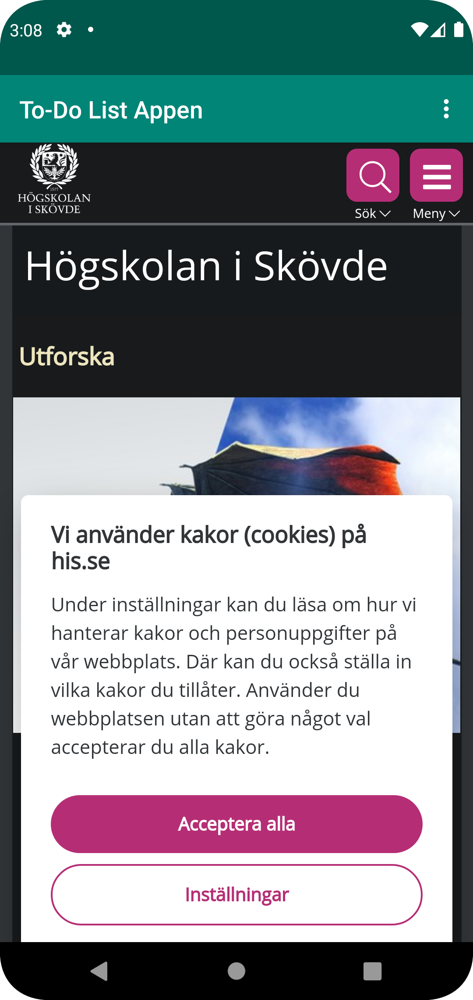

# Rapport

**Skriv din rapport här!**

I denna del så har det var en massa olika saker man har fått göra, lite kortfattat vad som har gjorts och ändrats i koden är följande. 
Man fick ändra namn på olika namn samt lägga till externa och interna länkar för appen sedan så fick man göra en massa olika saker mer exakt vad som har ändrast kommer nedanför tillsammans med koderna som har ändrasts 

## Följande grundsyn gäller dugga-svar:
Detta var första frågan där ändringen gjordes i strings.xml filen där man ändrade namnet på appen. 
<string name="app_name">To-Do List Appen</string>

Detta var när man gav internet tillgänglig för appen för att det skulle fungera. 
  <uses-permission android:name="android.permission.INTERNET" />

I denna fråga så ändrades element från TextView till Webview för att det skulle fungera. Samt så är denna för frågan efter där de stod my_textview som ändrades till
my_webview detta var dem 2 ändringar som gjordes. 
<WebView
android:id="@+id/my_webview"


Detta var nästa ändring där man till findViewbyId för Webview. Dessa ändringar gjordes för att kunna besvara dem 2 följande frågorna. samt så skapades en private 
webview för att dem skulle lokaliserar och synca med varandra.
myWebView = findViewById(R.id.my_webview);

private WebView myWebView;

Här skapdes en WebViewclient
myWebView.setWebViewClient(new WebViewClient());

Samt så skapades en Javascript för att få den att fungera och göra den enable.
myWebView.getSettings().setJavaScriptEnabled(true);

Här är min HTML som har lagts till i assets filen samt så kan man kolla på screenhoten där de bild på min html fil som skapdes. 
<!DOCTYPE html>
<html lang="en">
<head>
    <meta charset="UTF-8">
    <meta http-equiv="X-UA-Compatible" content="IE=edge">
    <meta name="viewport" content="width=device-width, initial-scale=1.0">
    <title>Min HTML Fil</title>
</head>
<body>
    <h1>To Do List Appen</h1>
</body>
</html>

Följande koder är för dem 2 sista frågorna. Där det har skapats för koden för den externa och interna länkerna sedan så att koden ska köra för 
att hämta dem rätta länkerna.

public void showExternalWebPage() {
myWebView.loadUrl("https://www.his.se/");
}

public void showInternalWebPage() {
myWebView.loadUrl("file:///android_asset/HTML/MinHTMLFIL.html");
}

    @Override
    public boolean onOptionsItemSelected(MenuItem item) {
        int id = item.getItemId();

        if (id == R.id.action_external_web) {
            // Anropa showExternalWebPage() när External Web Page väljs från menyn
            showExternalWebPage();
            return true;
        }

        if (id == R.id.action_internal_web) {
            // Anropa showInternalWebPage() när Internal Web Page väljs från menyn
            showInternalWebPage();
            return true;
        }

        return super.onOptionsItemSelected(item);
    }
}


```

Bilder läggs i samma mapp som markdown-filen.




Läs gärna:

- Boulos, M.N.K., Warren, J., Gong, J. & Yue, P. (2010) Web GIS in practice VIII: HTML5 and the canvas element for interactive online mapping. International journal of health geographics 9, 14. Shin, Y. &
- Wunsche, B.C. (2013) A smartphone-based golf simulation exercise game for supporting arthritis patients. 2013 28th International Conference of Image and Vision Computing New Zealand (IVCNZ), IEEE, pp. 459–464.
- Wohlin, C., Runeson, P., Höst, M., Ohlsson, M.C., Regnell, B., Wesslén, A. (2012) Experimentation in Software Engineering, Berlin, Heidelberg: Springer Berlin Heidelberg.
